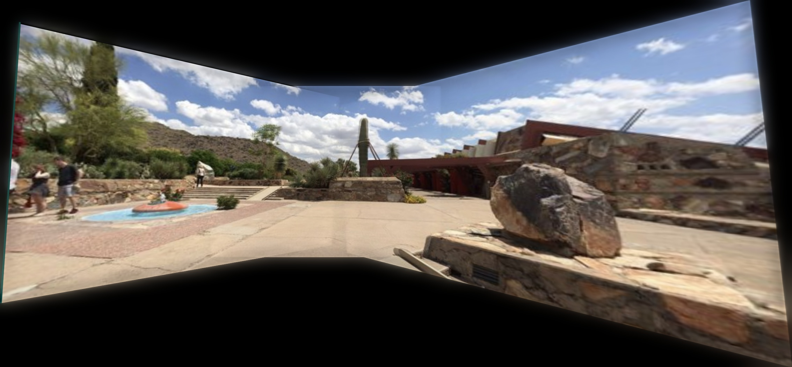

# 🖼️ Panorama Pro Stitcher

> SIFT/ORB 특징점 검출, RANSAC 호모그래피 추정, 멀티밴드 블렌딩을 활용한 OpenCV 기반 파노라마 이미지 스티칭 구현

[](https://www.python.org/)
[](https://opencv.org/)
[](https://numpy.org/)

---

## 📌 프로그램 개요

**Panorama Pro Stitcher**는 딥러닝 없이 전통적인 컴퓨터 비전 기법만으로 여러 장의 사진을 하나의 넓은 파노라마 이미지로 합성하는 파이프라인입니다.

특징점 검출 → 매칭 → 호모그래피 추정 → 이미지 워핑 → 블렌딩의 5단계 파이프라인을 **모듈 단위로 직접 구현**하였으며, 알고리즘과 블렌딩 방식을 CLI 옵션으로 자유롭게 선택할 수 있습니다.

---

## ✨ 주요 기능

### 1. 특징점 검출 및 매칭 (Feature Detection & Matching)

| 알고리즘 | 설명 | 디스크립터 | 매처 |
|----------|------|-----------|------|
| **SIFT** | 스케일·회전 불변 특징점 (기본값) | 128-dim float32 | FLANN (KD-Tree) |
| **ORB** | 고속 바이너리 특징점, 특허 없음 | 이진 디스크립터 | BFMatcher (Hamming) |

- **Lowe's Ratio Test**로 모호한 매칭 필터링 (임계값 조절 가능, 기본 0.75)

### 2. 호모그래피 추정 (Homography Estimation)

- **RANSAC** 기반 아웃라이어 제거로 정밀한 3×3 변환 행렬 계산
- **Homography Chaining**: 인접 쌍 간 행렬을 체인으로 연결해 중앙 기준 좌표계로 통합

### 3. 이미지 블렌딩 (Image Blending)

| 방식 | 설명 | 품질 |
|------|------|------|
| **Multi-band** (기본값) | 라플라시안 피라미드로 고주파·저주파 분리 블렌딩 | ★★★ 최고 |
| **Feathering** | 거리 변환 기반 알파 블렌딩 | ★★☆ 중간 |
| **Simple** | 단순 오버레이 (경계 처리 없음) | ★☆☆ 기본 |

### 4. 원통형 투영 전처리 (Cylindrical Projection)

- 넓은 시야각(FOV) 파노라마의 왜곡("보타이 현상")을 줄이는 전처리 단계
- 초점 거리 자동 추정 또는 수동 지정 가능

### 5. 기타

- 디버그 모드: 특징점 매칭 시각화 이미지 저장 (인라이어=초록, 아웃라이어=빨강)
- 입력 이미지 크기 제한 옵션 (`--max-size`)
- 결과 GUI 창 출력 (`--show`)

---

## 🔄 처리 파이프라인

```
입력 이미지 (왼쪽 → 오른쪽)
        │
        ▼
┌───────────────────────────────────────┐
│  Step 0  원통형 투영 (선택)            │  --cylindrical
│          넓은 FOV 왜곡 보정            │
└───────────────────────────────────────┘
        │
        ▼
┌───────────────────────────────────────┐
│  Step 1  특징점 검출 및 기술            │  SIFT / ORB
│          각 이미지에서 키포인트 추출    │
└───────────────────────────────────────┘
        │
        ▼
┌───────────────────────────────────────┐
│  Step 2  특징점 매칭                   │  FLANN / BFMatcher
│          Lowe's Ratio Test 필터링      │  + Ratio Test
└───────────────────────────────────────┘
        │
        ▼
┌───────────────────────────────────────┐
│  Step 3  호모그래피 추정               │  RANSAC
│          아웃라이어 제거 + 변환 행렬   │
└───────────────────────────────────────┘
        │
        ▼
┌───────────────────────────────────────┐
│  Step 4  호모그래피 체인 + 워핑        │  warpPerspective
│          공통 캔버스에 투영            │
└───────────────────────────────────────┘
        │
        ▼
┌───────────────────────────────────────┐
│  Step 5  이미지 블렌딩                 │  Multi-band /
│          경계 없는 자연스러운 합성     │  Feathering / Simple
└───────────────────────────────────────┘
        │
        ▼
  파노라마 이미지 저장 (output/panorama.jpg)
```

---

## 📂 폴더 구조

```
Panorama-Pro-Stitcher/
│
├── main.py              # CLI 진입점 — 인수 파싱 및 전체 실행 흐름
├── stitcher.py          # PanoramaStitcher 클래스 — 파이프라인 오케스트레이터
├── features.py          # 특징점 검출·기술·매칭 (SIFT/ORB, FLANN/BF)
├── homography.py        # 호모그래피 추정, 체인, 캔버스 계산, 워핑
├── blending.py          # Feathering 및 Multi-band 블렌딩 구현
├── projection.py        # 원통형 투영 및 초점 거리 추정
│
├── requirements.txt     # 의존성 패키지 목록
│
├── images/              # 입력 이미지 디렉토리 (왼쪽 → 오른쪽 순)
│   ├── image_01.jpg
│   ├── image_02.jpg
│   └── image_03.jpg
│
├── output/              # 결과 파노라마 저장 디렉토리
│   └── panorama.jpg
│
└── debug/               # 디버그 모드 시 생성 (--debug 옵션)
    ├── match_0_1.jpg    # 이미지 0↔1 특징점 매칭 시각화
    └── match_1_2.jpg    # 이미지 1↔2 특징점 매칭 시각화
```

---

## 🖼️ 결과물 (Before & After)

### 입력 이미지 (Before)

세 장의 연속 촬영 이미지를 왼쪽부터 순서대로 입력합니다.

| 이미지 1 (좌) | 이미지 2 (중) | 이미지 3 (우) |
|:---:|:---:|:---:|
|  |  |  |

> 각 이미지는 약 30~50% 시야각이 겹치도록 촬영되어야 합니다.

---

### 출력 파노라마 (After)

세 장의 이미지가 하나의 넓은 파노라마로 합성된 결과입니다.



> **적용 옵션:** SIFT 특징점 + Multi-band (Laplacian Pyramid) 블렌딩

---

## ⚙️ 설치 및 실행

### 요구 사항

- Python 3.8 이상
- pip

### 설치

```bash
git clone https://github.com/<your-username>/panorama-pro-stitcher.git
cd panorama-pro-stitcher

pip install -r requirements.txt
```

### 기본 실행

```bash
# images/ 폴더의 이미지를 SIFT + Multi-band 블렌딩으로 스티칭
python main.py
```

### 옵션별 실행 예시

```bash
# ORB 특징점 + Feathering 블렌딩
python main.py --feature ORB --blend feathering

# 원통형 투영 전처리 활성화 (넓은 FOV에 권장)
python main.py --cylindrical

# 초점 거리 직접 지정
python main.py --cylindrical --focal-length 800

# 특정 이미지 파일 지정
python main.py --images img1.jpg img2.jpg img3.jpg

# 결과 저장 경로 지정
python main.py --output results/my_panorama.jpg

# 디버그 이미지 저장 + 결과 창 표시
python main.py --debug --show

# 입력 이미지 최대 크기 제한 (긴 쪽 기준, px)
python main.py --max-size 3000
```

---

## 🛠️ CLI 옵션 전체 목록

| 옵션 | 기본값 | 설명 |
|------|--------|------|
| `--images`, `-i` | — | 스티칭할 이미지 파일 경로 목록 |
| `--input-dir`, `-d` | `images/` | 이미지 디렉토리 경로 |
| `--output`, `-o` | `output/panorama.jpg` | 결과 파일 저장 경로 |
| `--feature`, `-f` | `SIFT` | 특징점 알고리즘 (`SIFT` / `ORB`) |
| `--ratio` | `0.75` | Lowe's ratio test 임계값 (0.5~0.9) |
| `--ransac` | `4.0` | RANSAC 재투영 오차 임계값 (px) |
| `--blend`, `-b` | `multiband` | 블렌딩 방식 (`multiband` / `feathering` / `simple`) |
| `--levels` | `6` | Multi-band 피라미드 레벨 수 |
| `--cylindrical`, `-c` | `False` | 원통형 투영 전처리 활성화 |
| `--focal-length` | 자동 추정 | 원통형 투영 초점 거리 (px) |
| `--max-size` | `0` (제한 없음) | 입력 이미지 최대 크기 (px) |
| `--debug` | `False` | 매칭 시각화 이미지를 `debug/` 에 저장 |
| `--quiet`, `-q` | `False` | 진행 로그 숨김 |
| `--show`, `-s` | `False` | 결과를 GUI 창으로 표시 |

---

## 📦 의존성

```
opencv-python>=4.5.0
opencv-contrib-python>=4.5.0
numpy>=1.20.0
```

---

## 📐 알고리즘 상세

### Multi-band Blending (라플라시안 피라미드)

경계면에서 발생하는 색상 차이와 고주파 노이즈를 주파수 대역별로 분리해 블렌딩합니다.

```
이미지 A, 이미지 B
    │
    ▼
가우시안 피라미드 구성 (각 레벨 = 1/4 해상도)
    │
    ▼
라플라시안 피라미드 구성 (원본 - 업샘플된 하위 레벨)
    │
    ▼
각 레벨별 가중치 마스크로 블렌딩
  ┌─ 저주파 (색상) → 넓은 전환 구간 → 노출 차이 보정
  └─ 고주파 (질감) → 좁은 전환 구간 → 선명한 경계 유지
    │
    ▼
피라미드 재구성 (콜랩스) → 최종 블렌딩 결과
```

### Homography Chaining

N장의 이미지를 중앙 이미지 기준으로 정렬합니다.

```
이미지 순서:  0 → 1 → 2(기준) ← 3 ← 4

H_abs[2] = I           (기준 이미지, 항등 행렬)
H_abs[1] = H_01        (0→1 호모그래피의 역행렬 체인)
H_abs[0] = H_01 × H_12
H_abs[3] = H_23⁻¹
H_abs[4] = H_34⁻¹ × H_23⁻¹
```

---

## 📝 촬영 가이드

더 나은 결과를 위한 입력 이미지 촬영 팁:

- **겹침 비율**: 인접 이미지 간 약 **30~50%** 시야각이 겹치도록 촬영
- **촬영 방향**: 동일한 위치에서 카메라를 **수평 회전**하며 촬영
- **노출 고정**: 자동 노출보다 **수동 노출** 고정으로 촬영 시 블렌딩 품질 향상
- **파일 순서**: 이미지 파일명이 **왼쪽 → 오른쪽** 순서로 정렬되도록 네이밍

---

## 🏫 과목 정보

서울과학기술대학교 컴퓨터비전 (2026년 1학기) 과제 구현물입니다.
